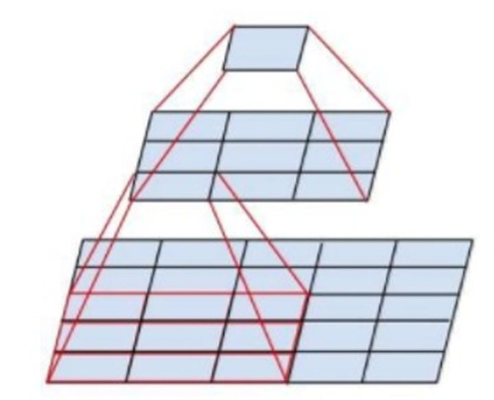
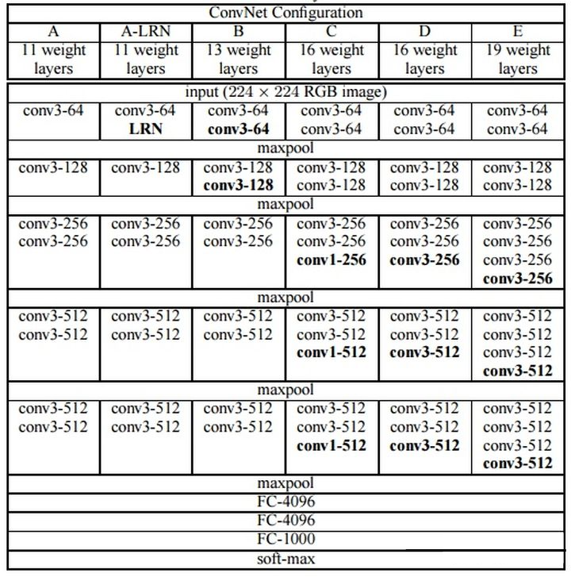
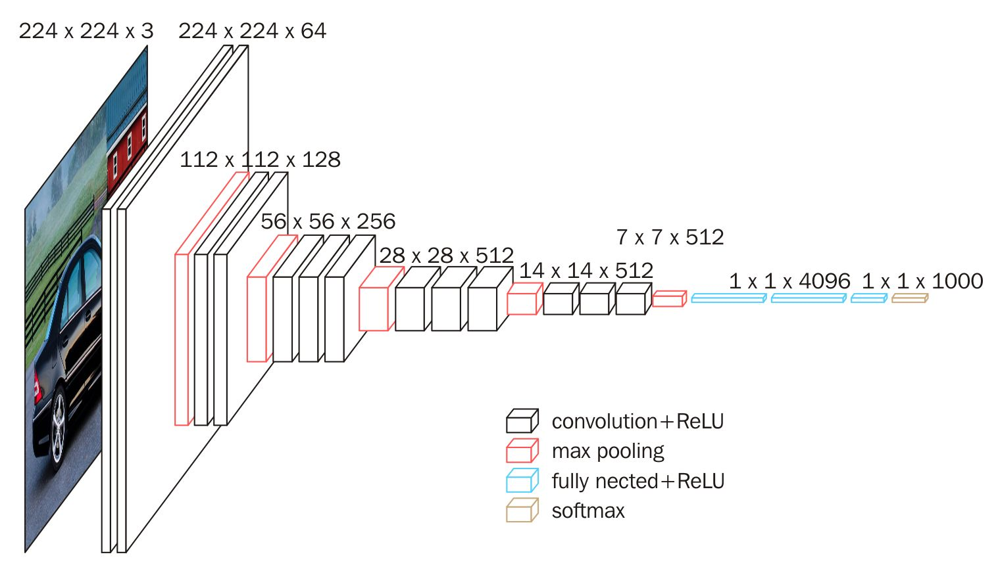

# VGG网络

名称来源于作者所在的牛津大学视觉几何组(Visual Geometry Group)的缩写。 

## VGG原理
采用连续的几个3x3的卷积核代替较大卷积核(11x11，7x7，5x5)

对于给定的感受野（与输出有关的输入图片的局部大小），采用堆积的小卷积核是优于采用大的卷积核，因为多层非线性层可以增加网络深度来保证学习更复杂的模式，而且代价还比较小（参数更少）

**拓展1: 2个3x3的卷积核为什么可以替代5x5的卷积核？**
 

```
如图，3x3的卷积层在5x5的区域里滑动，产生一个3x3的输出，
再使用一个3x3的卷积核在输出中滑动，可以得到和5x5的卷积核一样的输出效果。
```
**拓展2: 参数计算与比较**
```
# channel为通道数

2个3x3的卷积核的所需参数总量为2x(3x3xchannel)=18xchannel
1个5x5的卷积核的所需参数总量为5x5xchannel=25channel
由此可见，小而深的卷积核代价小于大而短的核
```

## VGG网络基本配置
下图的D，E配置即为常见的VGG16与VGG19(网络深度不同)



**图片解释**
```
以VGG16(D)为例，
输入图片依次经历了: 卷积x2-池化-卷积x2-池化-卷积x3-池化-卷积x3-池化-卷积x3-池化-全连接-全连接-全连接-输出分类
conv3-64: 64个卷积核大小为3x3的卷积层
maxpool: 池化层
FC-4096: 通道数为4096的全连接层(Full Connection)
```

**VGG网络默认:**
```
卷积核大小为3x3，步长为1
池化核大小为2x2，步长为2
卷积计算采用`padding='SAME'`进行边的补零操作
卷积层激活函数(Activation Function)默认为Relu函数
```

**拓展3: 卷积参数padding**
```
valid只进行有效卷积，对边界数据不处理，卷积后输出shape会变小
same对边界进行补零操作，可以保证输入shape与输出shape相同
```

**理解**
```
通道数越大，网络深度越深，可提取特征值越多
全连接层通道数4096为经验数值，调参实验而来
卷积层和全连接层有权重系数，称为权重层
卷积层和池化层负责特征提取，全连接层负责分类任务
```

## VGG16网络结构图



```
1）输入图像尺寸为224x224x3，经64个通道为3的3x3的卷积核，步长为1，padding=same填充，卷积两次，再经ReLU激活，输出的尺寸大小为224x224x64

2）经max pooling（最大化池化），滤波器为2x2，步长为2，图像尺寸减半，池化后的尺寸变为112x112x64

3）经128个3x3的卷积核，两次卷积，ReLU激活，尺寸变为112x112x128

4）max pooling池化，尺寸变为56x56x128

5）经256个3x3的卷积核，三次卷积，ReLU激活，尺寸变为56x56x256

6）max pooling池化，尺寸变为28x28x256

7）经512个3x3的卷积核，三次卷积，ReLU激活，尺寸变为28x28x512

8）max pooling池化，尺寸变为14x14x512

9）经512个3x3的卷积核，三次卷积，经ReLU激活，尺寸变为14x14x512

10）max pooling池化，尺寸变为7x7x512

11）再经过两层1x1x4096，一层1x1x1000的全连接层（共三层），经ReLU激活

12）最后通过softmax输出1000个预测结果
```


## 参考
[知乎: 一文读懂VGG网络](https://zhuanlan.zhihu.com/p/41423739)  

[知乎提问: 卷积神经网络的卷积核](https://www.zhihu.com/question/38098038)  

[深度学习-VGG16原理详解](https://blog.csdn.net/weixin_43496706/article/details/101210981)  

[神经网络学习小记录16](https://blog.csdn.net/weixin_44791964/article/details/102585038)  
