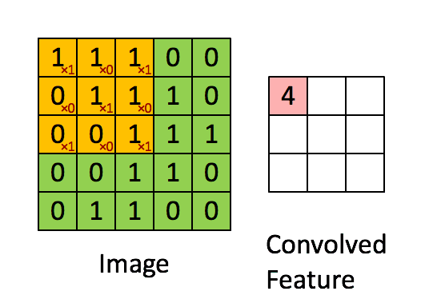
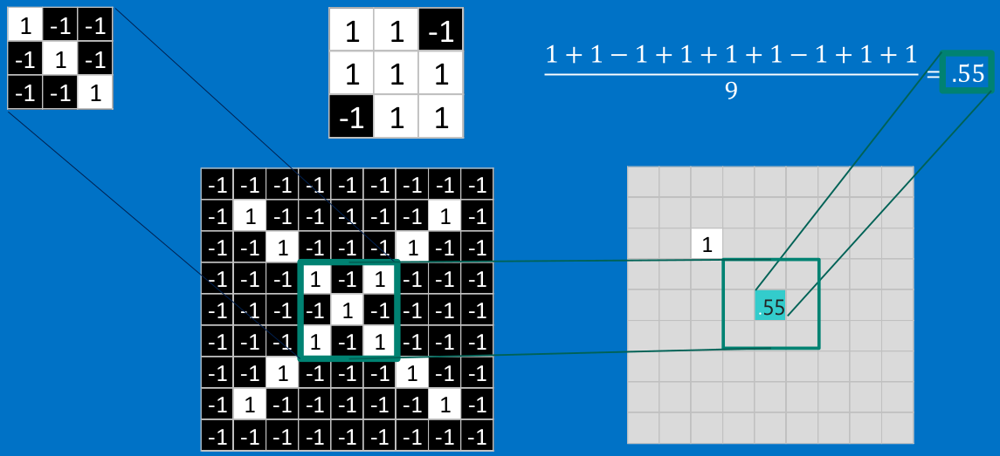
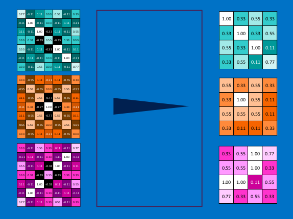
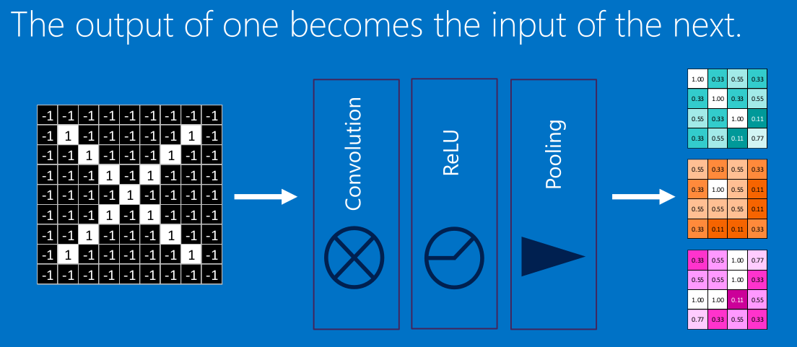

# 卷积神经网络学习笔记

转载整理自[通俗理解卷积神经网络](https://blog.csdn.net/v_JULY_v/article/details/51812459)  

转载整理自[卷积神经网络CNN究竟是怎样一步一步工作的](https://www.jianshu.com/p/fe428f0b32c1)

## 人工神经网络  

神经网络由大量的神经元相互连接而成。每个神经元接受线性组合的输入后，最开始只是简单的线性加权，后来给每个神经元加上了非线性的激活函数，从而进行非线性变换后输出。每两个神经元之间的连接代表加权值，称之为权重（weight）。不同的权重和激活函数，则会导致神经网络不同的输出。  


基本wx + b的形式，其中  

* x1, x2表示输入向量
* w1, w2为权重，几个输入则意味着有几个权重，即每个输入都被赋予一个权重
* b为偏置bias
* g(z) 为激活函数
* a 为输出

举例：
```
有一场音乐节，去或不去？

x1是否有喜欢的演唱嘉宾。x1=1为你喜欢这些嘉宾，x1=0为你不喜欢这些嘉宾。嘉宾因素的权重=7

x2是否有人陪你同去。x2=1为有人陪你同去，x2=0为没人陪你去。是否有人陪同的权重=3

决策模型便建立起来了：g(z) = g(w1*x1 + w2*x2 + b)，
g表示激活函数，这里的b可以理解成: 为更好达到目标而做调整的偏置项。
```

## 激励函数  

常用的非线性激活函数有sigmoid、tanh、relu等等，前两者sigmoid/tanh比较常见于全连接层，后者relu常见于卷积层。  

激励函数详细介绍可参考[神经网络常用激励函数]()  

## 神经网络结构  


## 卷积运算实例  

**举例: 确定一幅图像是包含有"X"还是"O"？**


在CNN中有这样一个问题，就是每次给你一张图，你需要判断它是否含有"X"或者"O"。并且假设必须两者选其一，不是"X"就是"O"。理想的情况就像这个样子：  


<center>(标准的"X"和"O"，字母位于图像的正中央，并且比例合适，无变形)</center>

对于计算机来说，只要图像稍稍有一点变化，不是标准的，那么要解决这个问题还是不是那么容易的： 


计算机要解决上面这个问题，一个比较天真的做法就是先保存一张"X"和"O"的标准图像（就像前面给出的例子），然后将其他的新给出的图像来和这两张标准图像进行对比，看看到底和哪一张图更匹配，就判断为哪个字母。但是这么做的话，其实是非常不可靠的，因为计算机还是比较死板的。

在计算机的“视觉”中，一幅图看起来就像是一个二维的像素数组（可以想象成一个棋盘），每一个位置对应一个数字。在我们这个例子当中，像素值"1"代表白色，像素值"-1"代表黑色。  


当比较两幅图的时候，如果有任何一个像素值不匹配，那么这两幅图就不匹配，至少对于计算机来说是这样的。

对于这个例子，计算机认为上述两幅图中的白色像素除了中间的3*3的小方格里面是相同的，其他四个角上都不同：  
<div align=center>


</div>

因此，从表面上看，计算机判别右边那幅图不是"X"，两幅图不同，得出结论：  


但是这么做，显得太不合理了。理想的情况下，我们希望，对于那些仅仅只是做了一些像平移，缩放，旋转，微变形等简单变换的图像，计算机仍然能够识别出图中的"X"和"O"。像下面这些情况，我们希望计算机依然能够很快并且很准的识别出来：  


**特征Features**  
---
对于CNN来说，它是一块一块地来进行比对。它拿来比对的这个“小块”我们称之为Features（特征）。在两幅图中大致相同的位置找到一些粗糙的特征进行匹配，CNN能够更好的看到两幅图的相似性，相比起传统的整幅图逐一比对的方法。  


每一个feature就像是一个小图（就是一个比较小的有值的二维数组）。不同的Feature匹配图像中不同的特征。在字母"X"的例子中，那些由对角线和交叉线组成的features基本上能够识别出大多数"X"所具有的重要特征。  


这些features很有可能就是匹配任何含有字母"X"的图中字母X的四个角和它的中心。那么具体到底是怎么匹配的呢？举例如下：  
<div align="center">


</div>

**卷积计算GIF**
---


当给你一张新的图时，CNN并不能准确地知道这些features到底要匹配原图的哪些部分，所以它会在原图中每一个可能的位置进行尝试。这样在原始整幅图上每一个位置进行匹配计算，我们相当于把这个feature变成了一个过滤器。这个我们用来匹配的过程就被称为卷积操作，这也就是卷积神经网络名字的由来。  

这个卷积操作背后的数学知识其实非常的简单。要计算一个feature和其在原图上对应的某一小块的结果，只需要简单地将两个小块内对应位置的像素值进行乘法运算，然后将整个小块内乘法运算的结果累加起来，最后再除以小块内像素点总个数即可。如果两个像素点都是白色（也就是值均为1），那么1*1 = 1，如果均为黑色，那么(-1)*(-1) = 1。不管哪种情况，每一对能够匹配上的像素，其相乘结果为1。类似地，任何不匹配的像素相乘结果为-1。如果一个feature（比如n*n）内部所有的像素都和原图中对应一小块（n*n）匹配上了，那么它们对应像素值相乘再累加就等于n2，然后除以像素点总个数n2，结果就是1。同理，如果每一个像素都不匹配，那么结果就是-1。具体过程如下：  




最后得到的结果就是这样了：  


为了完成我们的卷积，我们不断地重复着上述过程，将feature和图中每一块进行卷积操作。最后通过每一个feature的卷积操作，我们会得到一个新的二维数组。这也可以理解为对原始图像进行过滤的结果，我们称之为feature map，它是每一个feature从原始图像中提取出来的“特征”。其中的值，越接近为1表示对应位置和feature的匹配越完整，越是接近-1，表示对应位置和feature的反面匹配越完整，而值接近0的表示对应位置没有任何匹配或者说没有什么关联。  

这样我们的原始图，经过不同feature的卷积操作就变成了一系列的feature map。我们可以很方便，直观地将这整个操作视为一个单独的处理过程。在CNN中，我们称之为卷积层(convolution layer)，这样你可能很快就会想到后面肯定还有其他的layer。没错，后面会提到。我们可以将卷积层看成下面这个样子：  


因此可想而知，CNN其实做的操作也没什么复杂的。但是尽管我们能够以这一点篇幅就描述了CNN的工作，其内部的加法，乘法和除法操作的次数其实会增加地很快。从数学的角度来说，它们会随着图像的大小，每一个filter的大小和filter的数目呈线性增长。由于有这么多因素的影响，很容易使得这个问题的计算量变得相当的庞大。  

**池化(Pooling)**
---
CNN中使用的另一个有效的工具被称为“池化(Pooling)”。池化可以将一幅大的图像缩小，同时又保留其中的重要信息。池化背后的数学顶多也就是小学二年级水平。它就是将输入图像进行缩小，减少像素信息，只保留重要信息。通常情况下，池化都是2x2大小，比如对于max-pooling来说，就是取输入图像中2x2大小的块中的最大值，作为结果的像素值，相当于将原始图像缩小了4倍。(注：同理，对于average-pooling来说，就是取2x2大小块的平均值作为结果的像素值。)  


然后对所有的feature map执行同样的操作，得到如下结果：  


因为最大池化（max-pooling）保留了每一个小块内的最大值，所以它相当于保留了这一块最佳的匹配结果（因为值越接近1表示匹配越好）。这也就意味着它不会具体关注窗口内到底是哪一个地方匹配了，而只关注是不是有某个地方匹配上了。这也就能够看出，CNN能够发现图像中是否具有某种特征，而不用在意到底在哪里具有这种特征。这也就能够帮助解决之前提到的计算机逐一像素匹配的死板做法。  

当对所有的feature map执行池化操作之后，相当于一系列输入的大图变成了一系列小图。同样地，我们可以将这整个操作看作是一个操作，这也就是CNN中的池化层(pooling layer)，如下：  



通过加入池化层，可以很大程度上减少计算量，降低机器负载。  

**激活函数Relu (Rectified Linear Units)**
---
对于输入的负值，输出全为0，对于正值，原样输出  


同样地，在CNN中，我们这一系列操作视为一个操作，那么就得到Relu Layer  


**深度学习Deep Learning**
---
最后，我们将上面所提到的卷积，池化，激活放在一起，就是下面这个样子：  



然后，我们加大网络的深度，增加更多的层，就得到深度神经网络了：  


**全连接层Fully connected layers**
---


后面其实是一个回归分类的过程。对于普通的分类问题，最后就是逻辑回归regression，多分类会用到softmax回归。将全连接得到的列向量比如n维列向量[1,n]乘以权重矩[n,2]，最后得到一个[1,2]的结果（这2个数值可以理解为代表属于两类的概率）用于进行二分类。多分类问题类比，softmax会得到属于每一类的概率，取概率最大的一类作为预测结果。  

至于权重，那个是学习出来的，这里的0.92和0.51只是随便给出的两个数字打个比方，概率大的我们认为更有可能是那一类。  

根据结果判定为"X"：  


综合上述所有结构  


这一整个过程，从前到后，被称作”前向传播“，得到一组输出，然后通过反向传播来不断纠正错误，进行学习。  

