# 神经网络常用激励函数

## ReLU
```
当x小于0时输出为0，当x大于0时输出为x，其图像如下：
```
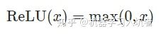
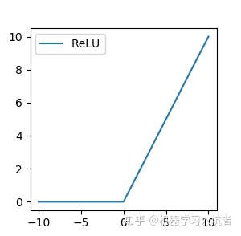

## Sigmoid
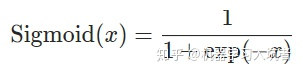
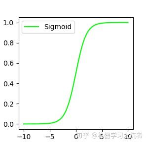

## Tanh
```
数学中的双曲正切函数Tanh也是一种神经网络常用的激活函数，
尤其是用于图像生成任务的最后一层
```
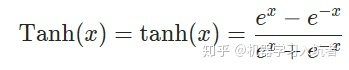
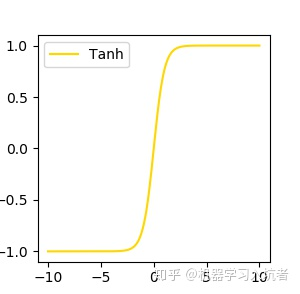

## LeakyReLu
```
上述的ReLU对x小于0的情况均输出0，而LeakyReLU在x小于0时可以输出非0值
```
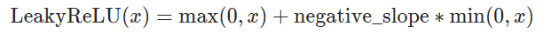
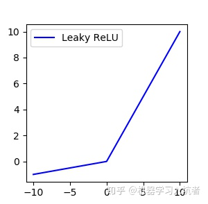

## ELU
```
同样是针对ReLU的负数部分进行的改进，ELU激活函数对x小于零的情况采用类似指数计算的方式进行输出
```
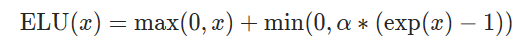
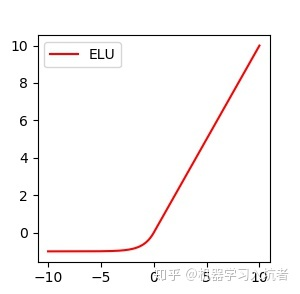

## PReLU
```
PReLU和LeakyReLU的图像虽然比较类似，但是二者的斜率计算方式是不同的：
```
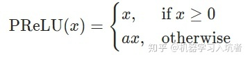
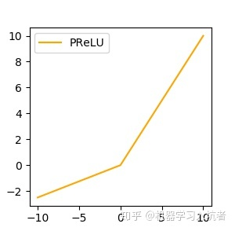

## ReLU6
```
输出限制在深度学习中是一种比较常见的手段，ReLU6限制ReLU的的输出不超过6
```
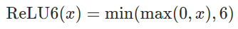
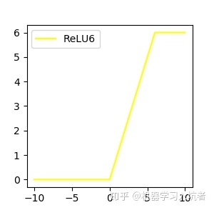

## RReLU
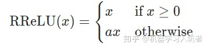


## SELU
```
SELU和ELU的形式比较类似，但是多出一个scale
```
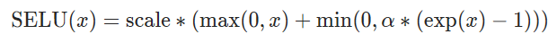
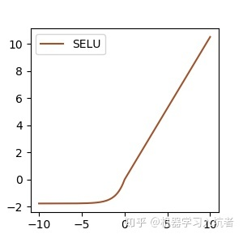

## CELU
```
与上述的SELU类似，CELU同样采用负数区间为指数计算，整数区间为线性计算
```
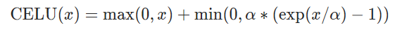
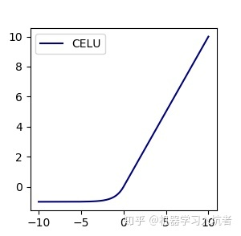

## LogSigmoid
```
LogSigmoid对Sigmoid进行了对数计算
```
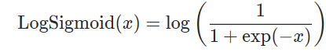
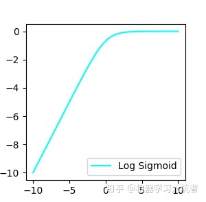

## Tanhshrink
```
上述的Tanh表述双曲正切计算，Tanhshrink直接采用输入减去双曲正切值：
```
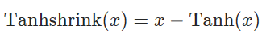


